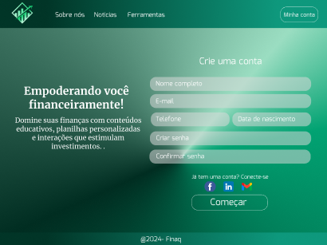

# FECAP - Fundação de Comércio Álvares Penteado

# FINAQ

## Projeto 5

**Grupo**: 5

**Integrantes**: 
- Flavia Costa (20021548)
- Guilhermy Garcia (23025371)
- Gustavo Bernardi (24026339)
- Kamila Santos (24026235)
- Lavinia Pires (24026315)

## Imagem da Home Page

Projeto5
│
├── /frontend                # Diretório principal do frontend
│   ├── /img                 # Imagens do frontend (ícones de redes sociais, logotipo)
│   │   ├── facebook.png
│   │   ├── gmail.png
│   │   ├── linkedin.png
│   │   ├── logo.png
│   │   ├── index.html
│   │   ├── script.js
│   │   └── style.css
│   ├── /React               # Diretório específico para o desenvolvimento em React
│   │   ├── /public          # Arquivos públicos
│   │   └── /src             # Código-fonte do React
│   │       ├── /components  # Componentes React
│   │       │   ├── /img     # Imagens usadas nos componentes React
│   │       │   ├── AboutUs.js
│   │       │   ├── Footer.js
│   │       │   ├── Footer.css
│   │       │   ├── Header.js
│   │       │   ├── Header.css
│   │       │   ├── Hero.js
│   │       │   ├── Home.js
│   │       │   ├── News.js
│   │       │   ├── Sucess.js
│   │       │   └── Tools.js
│   │       ├── App.js
│   │       ├── App.css
│   │       ├── App.test.js
│   │       ├── index.css
│   │       ├── index.js
│   │       ├── logo.svg
│   │       ├── reportWebVitals.js
│   │       └── setupTests.js
│   ├── .gitignore           # Arquivo gitignore
│   ├── package-lock.json     # Dependências do projeto
│   ├── package.json          # Arquivo de configuração do projeto e dependências
│   └── README.md             # Arquivo de documentação (você está aqui)
